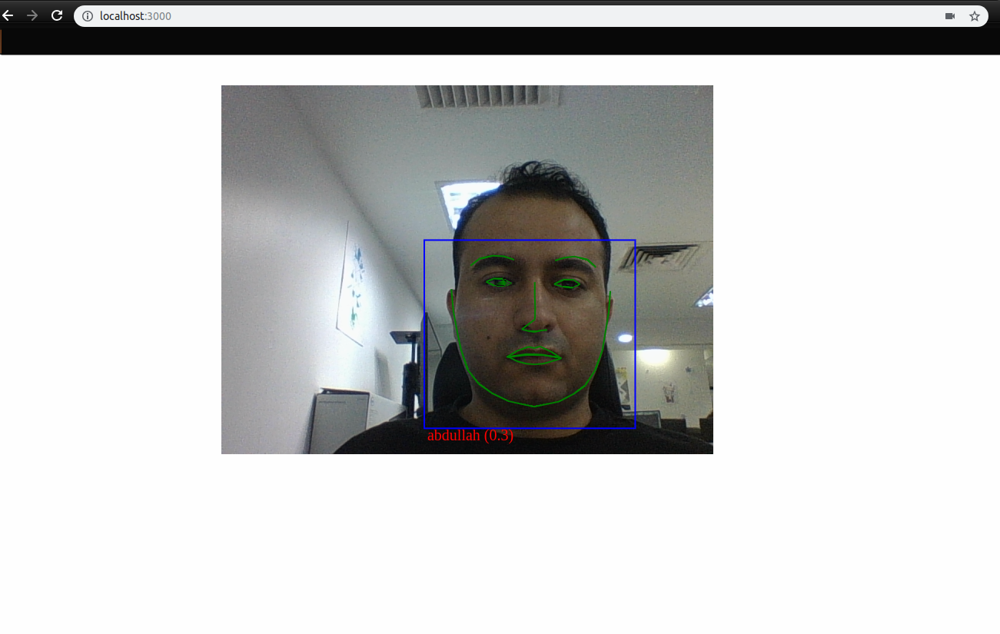

## Face tracking and detection with webcam

Playing with an example repurposed from [face-api.js](https://github.com/justadudewhohacks/face-api.js) for hackweek.

To start:

```
npm i
npm start
```

Browse to http://localhost:3000/.

This example is modified to only use the Tiny Face Detector and the webcam directly. All other non-related code has been reduced and removed. For the full examples, visit the face-api.js library itself.

### Using Face Detection

In order for face detection to work you will need to create at least 1 reference object.

Inside the images folder:
1) create a folder with the reference name (e.g. john):
2) Inside the folder, add 3 images with these names (john1.jpeg, john2.jpeg, john3.jpeg). Please note the use of the extension (jpeg, and the numbers 1, 2, 3). This was a quick example so few of these things are hardcoded but you can edit all of these in the file main.js
3) update the array of classes inside the main.js file with the name of the reference (folder).

Example output image:



#### Branches
Check the different branches for different code configuration
branch: `multiple-faces` (for webcam and multiple face detection)
branch: `multiple-faces-from-video` (for detection from a video source. Put the video in the media folder and change the source in the `index.html` file.)